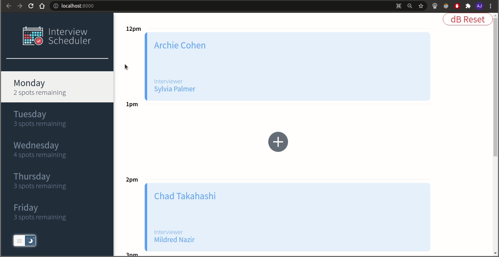
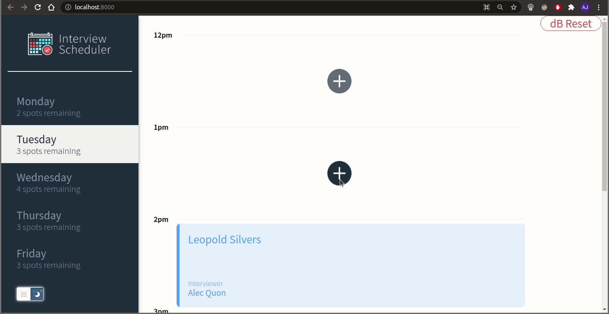
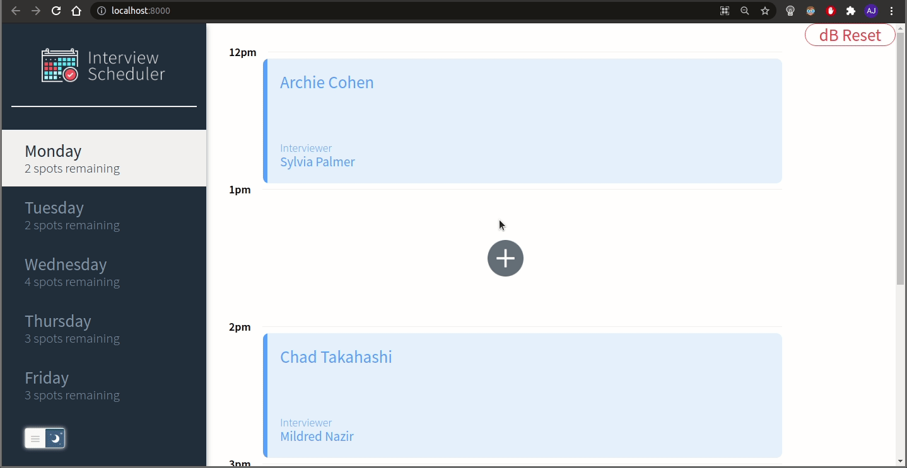
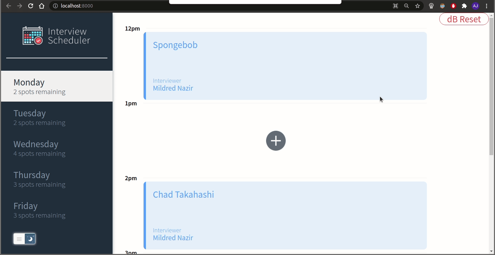
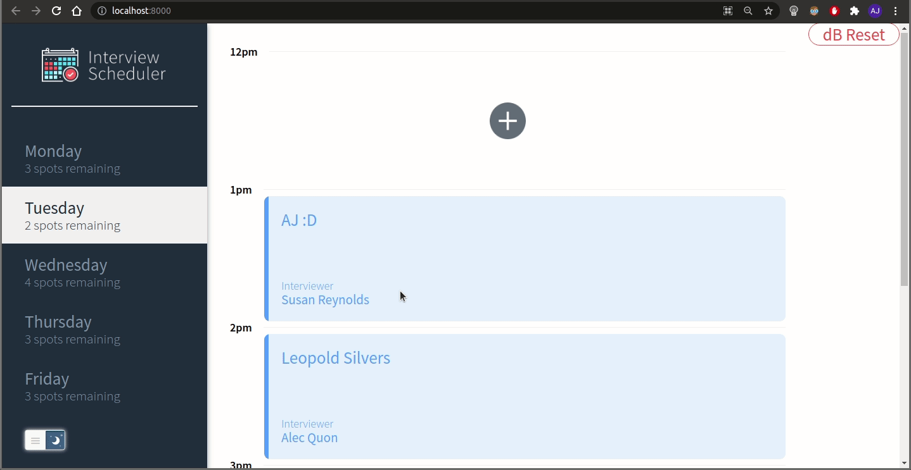
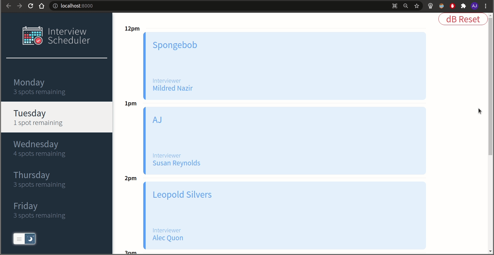
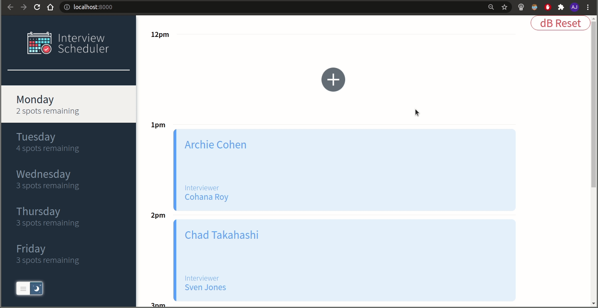

# Interview Scheduler

A React application that allows the user to add, edit and delete interview appointments .

## Final Product

To Browse through the appointments in different days. The user can view all the appointments on the weekdays as shown below:



## [Book New Appointment]

The user can add a new appointment by clicking on the add or (➕) button in the empty slots available as seen below:



## [Edit Appointment]

The user can edit existing appointments by clicking on the edit icon on the bottom right on the existing appointment. After entering the information, the user can save and implement the new changes or click cancel and revert back to the older appointment as shown below:



## [Delete Appointment]

The user can delete existing appointments by clicking on the trash icon. The user will be asked to confirm or cancel deletion.



## [Form Validation and Error Handling]

### Error: Empty Student Name

If the name of student is not entered, the user will be asked to enter the name. If the user cannot book an appointment or delete an appointment, an error will be shown to the user as can be seen below:



### Error: Interviewer NOT selected

If an interviewer is not selected, an error message appears to remind the user to select interviewer from the list


### [Server Error]

In the event of network / server error, a dialog box is displayed.



## [Database RESET]

To facilitate testing, clicking on the dB reset button resets and seeds the database with new random data. :D

## 

## Optimization

This project can be improved by doing the following:

- Implement a registration / login / logout
- Deploy on Heroku for the backend and Netlify for the frontend
- Implement a CI/CD (continuous integration / continuous deployment)
- Connect to a websocket server

## Setup

Install dependencies with `npm install`.

## Running Webpack Development Server

```sh
npm start
```

## Running Jest Test Framework

```sh
npm test
```

## Running Storybook Visual Testbed

```sh
npm run storybook
```

## Dependencies

- React
- React Testing Library
- Webpack Development Server
- Axios
- Class Names
- Cypress
